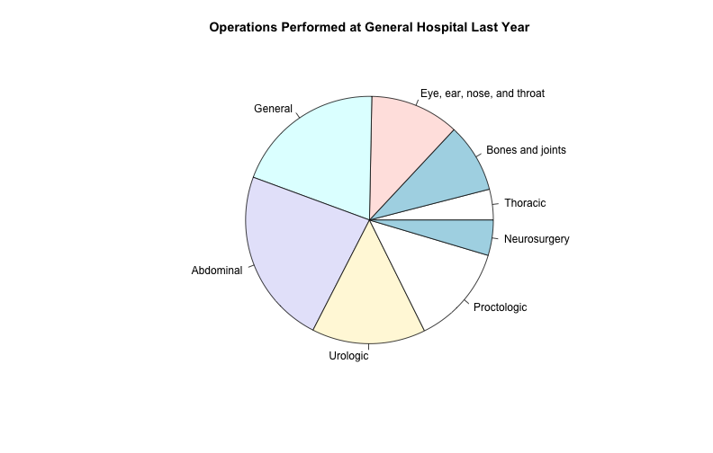
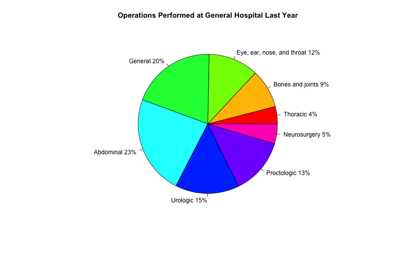
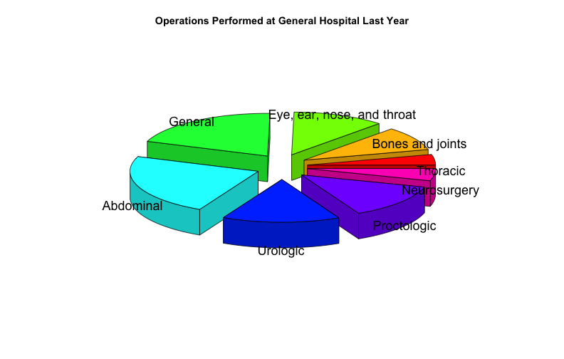
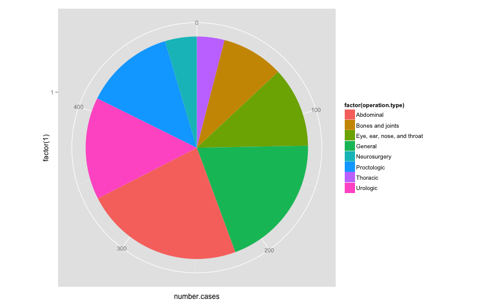

Pie Charts
========================================================

## Data

```r
operation.type <- c("Thoracic", "Bones and joints", 
                    "Eye, ear, nose, and throat", "General", "Abdominal", 
                    "Urologic", "Proctologic", "Neurosurgery")

number.cases <- c(20,45,58,98,115,74,65,23)

operations <- data.frame(operation.type, number.cases)
```

## Simple Pie Chart

```r
pie(number.cases, labels = operation.type, 
    main="Operations Performed at General Hospital Last Year")
```

 

## Pie Chart with Percentages

```r
pct <- round(number.cases/sum(number.cases)*100)

lbls <- paste(operation.type, pct) # add percents to labels 
lbls <- paste(lbls,"%",sep="") # ad % to labels 

pie(number.cases, labels = lbls, col=rainbow(length(lbls)),
       main="Operations Performed at General Hospital Last Year")
```

 

## 3D Exploded Pie Chart

```r
library(plotrix)

pie3D(number.cases,labels=operation.type,explode=0.2,
       main="Operations Performed at General Hospital Last Year")
```

 
       
## Pie Charts in ggplot2

```r
library(ggplot2)
p = ggplot(data=operations, 
       aes(x=factor(1),
           y=number.cases,
           fill = factor(operation.type)
      ),
)
p=p + geom_bar(width = 1, stat="identity") 
p = p + coord_polar(theta="y") 
p
```

 

