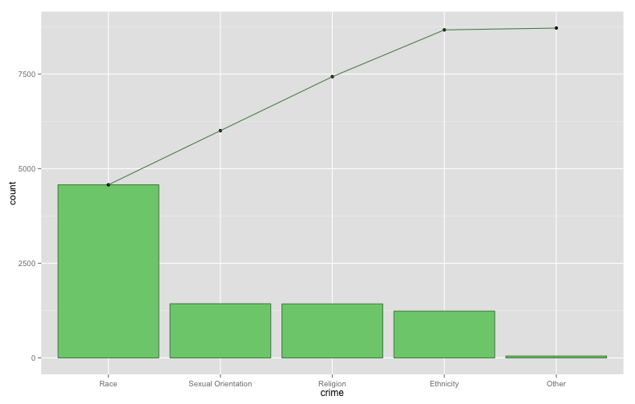

Pareto Diagrams
========================================================

## Data
The FBI reported the number of hate crimes by category for 2003 (http://www.fbi.gov/). 

```r
crime <- c("Race","Sexual Orientation","Religion","Ethnicity","Other")
count <- c(4574,1430,1426,1236,49)

hate.crimes <- data.frame(  
    crime = crime,
    count = count,
    stringsAsFactors=FALSE)
rm(crime, count)

hate.crimes <- hate.crimes[order(hate.crimes$count, decreasing=TRUE), ]
hate.crimes$crime <- factor(hate.crimes$crime, levels=hate.crimes$crime)
hate.crimes$cumulative <- cumsum(hate.crimes$count)

hate.crimes$percentage <- hate.crimes$count / sum(hate.crimes$count) * 100
hate.crimes$cumulative.percentage <- cumsum(hate.crimes$percentage)
hate.crimes$cumulative.percentage <- round(hate.crimes$cumulative.percentage, digits = 2)

hate.crimes
```

```
##                crime count cumulative percentage cumulative.percentage
## 1               Race  4574       4574    52.4842                 52.48
## 2 Sexual Orientation  1430       6004    16.4085                 68.89
## 3           Religion  1426       7430    16.3626                 85.26
## 4          Ethnicity  1236       8666    14.1824                 99.44
## 5              Other    49       8715     0.5622                100.00
```

## Pareto Chart

```r
library(ggplot2)

ggplot(hate.crimes, aes(x=crime)) +
    geom_bar(aes(y=count), colour="palegreen4", fill="palegreen3", stat="identity") +
    geom_point(aes(y=cumulative)) +
    geom_path(aes(y=cumulative, group=1), colour="palegreen4") +
    labs(title="Pareto Chart of Crime") +
    theme(plot.title = element_text(lineheight=.8, face="bold")) +
    xlab("Crime") +
    ylab("Count") +
    scale_y_continuous(breaks=seq(0, 9000, 1000))
```

 

