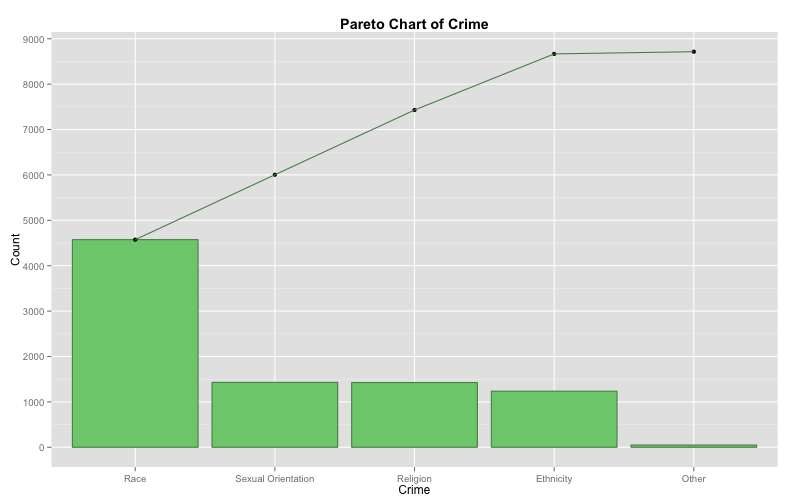

Pareto Diagrams
========================================================

## Data
The FBI reported the number of hate crimes by category for 2003 (http://www.fbi.gov/). 

```r
library(xtable)

crime <- c("Race","Sexual Orientation","Religion","Ethnicity","Other")
count <- c(4574,1430,1426,1236,49)

hate.crimes <- data.frame(  
    crime = crime,
    count = count,
    stringsAsFactors=FALSE)
rm(crime, count)

hate.crimes <- hate.crimes[order(hate.crimes$count, decreasing=TRUE), ]
hate.crimes$crime <- factor(hate.crimes$crime, levels=hate.crimes$crime)
hate.crimes$cumulative <- cumsum(hate.crimes$count)

hate.crimes$percentage <- hate.crimes$count / sum(hate.crimes$count) * 100
hate.crimes$cumulative.percentage <- cumsum(hate.crimes$percentage)
hate.crimes$cumulative.percentage <- round(hate.crimes$cumulative.percentage, digits = 2)

xt <- xtable(hate.crimes)
print(xt, type="html")
```

```
## <!-- html table generated in R 3.1.0 by xtable 1.7-3 package -->
## <!-- Fri Jul  4 18:28:34 2014 -->
## <TABLE border=1>
## <TR> <TH>  </TH> <TH> crime </TH> <TH> count </TH> <TH> cumulative </TH> <TH> percentage </TH> <TH> cumulative.percentage </TH>  </TR>
##   <TR> <TD align="right"> 1 </TD> <TD> Race </TD> <TD align="right"> 4574.00 </TD> <TD align="right"> 4574.00 </TD> <TD align="right"> 52.48 </TD> <TD align="right"> 52.48 </TD> </TR>
##   <TR> <TD align="right"> 2 </TD> <TD> Sexual Orientation </TD> <TD align="right"> 1430.00 </TD> <TD align="right"> 6004.00 </TD> <TD align="right"> 16.41 </TD> <TD align="right"> 68.89 </TD> </TR>
##   <TR> <TD align="right"> 3 </TD> <TD> Religion </TD> <TD align="right"> 1426.00 </TD> <TD align="right"> 7430.00 </TD> <TD align="right"> 16.36 </TD> <TD align="right"> 85.26 </TD> </TR>
##   <TR> <TD align="right"> 4 </TD> <TD> Ethnicity </TD> <TD align="right"> 1236.00 </TD> <TD align="right"> 8666.00 </TD> <TD align="right"> 14.18 </TD> <TD align="right"> 99.44 </TD> </TR>
##   <TR> <TD align="right"> 5 </TD> <TD> Other </TD> <TD align="right"> 49.00 </TD> <TD align="right"> 8715.00 </TD> <TD align="right"> 0.56 </TD> <TD align="right"> 100.00 </TD> </TR>
##    </TABLE>
```

```r
print(xt)
```

```
## % latex table generated in R 3.1.0 by xtable 1.7-3 package
## % Fri Jul  4 18:28:34 2014
## \begin{table}[ht]
## \centering
## \begin{tabular}{rlrrrr}
##   \hline
##  & crime & count & cumulative & percentage & cumulative.percentage \\ 
##   \hline
## 1 & Race & 4574.00 & 4574.00 & 52.48 & 52.48 \\ 
##   2 & Sexual Orientation & 1430.00 & 6004.00 & 16.41 & 68.89 \\ 
##   3 & Religion & 1426.00 & 7430.00 & 16.36 & 85.26 \\ 
##   4 & Ethnicity & 1236.00 & 8666.00 & 14.18 & 99.44 \\ 
##   5 & Other & 49.00 & 8715.00 & 0.56 & 100.00 \\ 
##    \hline
## \end{tabular}
## \end{table}
```

## Pareto Chart

```r
library(ggplot2)

ggplot(hate.crimes, aes(x=crime)) +
    geom_bar(aes(y=count), colour="palegreen4", fill="palegreen3", stat="identity") +
    geom_point(aes(y=cumulative)) +
    geom_path(aes(y=cumulative, group=1), colour="palegreen4") 
```

 

```r
# + geom_text(aes(label = cumulative.percentage, y = cumulative), colour="red", size = 3, angle = 45)
```

